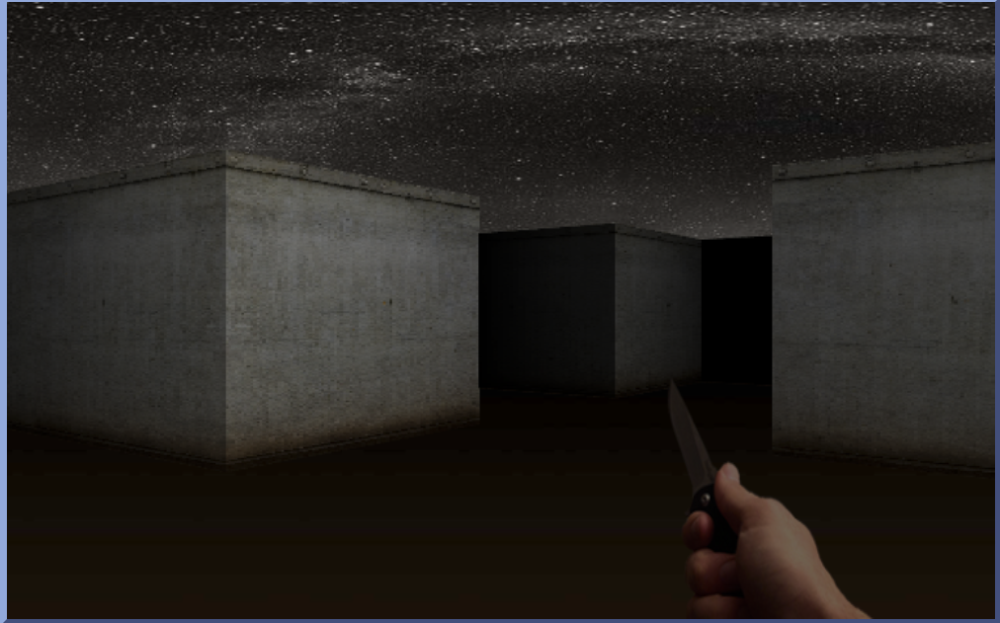

# 3d-with-raycasting

This is a simple 3D engine that uses raycasting to render a 3D world. It is inspired by the original Wolfenstein 3D game.

Check out the [demo](https://apssouza22.github.io/3d-with-raycast/).

